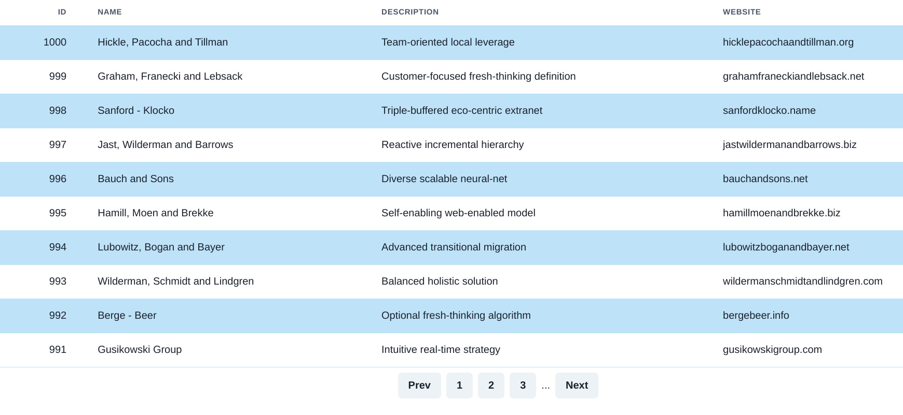

# Front End Tech Challenge

## Background information

This project was bootstrapped with [Create React App](https://github.com/facebook/create-react-app) including the TypeScript template.

This project is supported by a basic backend using [JSON Server](https://www.npmjs.com/package/json-server).

## Running the project

Run the project with:

`npm run start`

This will run the backend server on `http://localhost:4000` and it will start the React project on `http://localhost:3000`.

You will find that the backend has a single endpoint:

`GET` `/companies`

This endpoint will return an array of 200 fake companies. You can verify that this is working and running correctly by using your preferred API client such as Postman, Insomnia, etc.

## The task

The task is to write a React application that fetches the company data from the backend and displays it in a method of your choosing. You could display the companies in a table, or as "cards" on a grid, or a stack, you could implement pagination and only show 10 at a time.

### Bonus points

Bonus points will be awarded for:

- Using Redux
- Using TypeScript appropriately in your React components or Redux actions/reducers
- Using Material UI, or alternatively `styled-components`

### Screenshot

